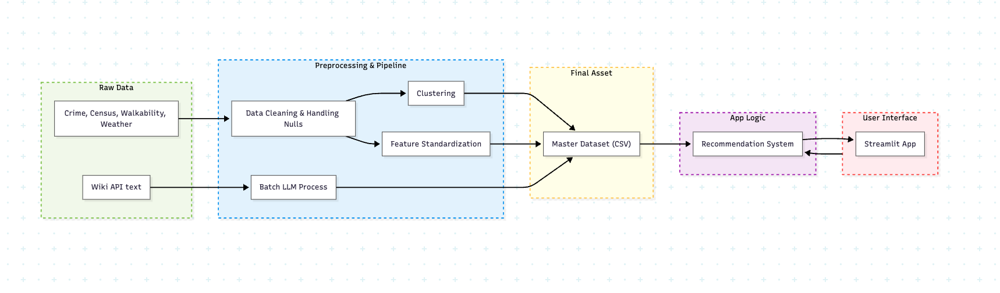

# 🌍 MoveSmart – Smart City Recommendation System

MoveSmart is a personalized decision-support system that recommends cities based on user-defined preferences such as affordability, weather, lifestyle, and urban characteristics.

Unlike static city ranking websites, MoveSmart allows users to actively shape recommendations through interactive preferences and a transparent scoring system.

Built as a data science capstone project focused on **recommendation systems, interpretability, and real-world evaluation challenges.**


## 🚀 Live Demo

👉 Try the dashboard here:

[](https://movesmart-nswpp8zxeczywx2phxuqxe.streamlit.app/) 


## Problem Statement

Choosing a city to live in or relocate to is a high-impact decision involving multiple tradeoffs (cost, climate, lifestyle, infrastructure).

However, existing platforms:
- Provide static rankings with no personalization
- Lack transparency in how rankings are generated
- Do not adapt to individual user priorities

MoveSmart addresses this gap by building a **user-driven and explainable city recommendation system**.


## Objectives

- Build a personalized recommendation engine for cities
- Enable **user-driven weighting of preferences**
- Combine **structured data + semantic (text-based) signals**
- Provide an interactive dashboard for exploration and comparison
- Design an explainable scoring system suitable for real-world decision-making


## Key Features

- Personalized city recommendations using user sliders
- Multi-factor scoring (affordability, weather, urban lifestyle, etc.)
- Semantic preference matching using text embeddings
- Hybrid scoring system with adjustable feature weights
- Interactive Streamlit dashboard for exploration


## Tech Stack

- **Python** – Pandas, NumPy, Scikit-learn, GeoPandas, Boto3, Requests etc
- **Streamlit** – Interactive frontend dashboard  
- **Sentence Transformers** – Semantic similarity modeling  
- **AWS Bedrock** – LLM

---

## System Architecture



## Main application

| Entry point | Role |
|-------------|------|
| **`app.py`** | Streamlit UI (`streamlit run app.py`). Reads **`data/final/Final_Enriched_Dataset.csv`**. |
| **`index.html`** | Static **about** page for the project (e.g. deployed on Netlify); linked from the Streamlit UI. |

Other Python modules (`src/recommender.py`, `src/visualizations.py`, `src/rag_explanation.py`) are imported by the app. Clustering used in the final dataset lives in **`models/cluster_model.py`**.

## Repository layout

```
movesmart/
├── app.py                      # Streamlit app (main UI)
├── index.html                  # Static about page for the project (separate from the Streamlit app)
├── assets/
│   └── flow_chart.png          # Pipeline / architecture diagram (shown at top of this README)
├── data/
│   ├── raw/                    # Primary source inputs (see Step 0); large files are often obtained locally and omitted from git
│   ├── processed/              # Per-source CBSA tables (loader outputs)
│   ├── evaluation/             # Stores evaluation results and analysis
│   ├── clustering_output/      # Clustering outputs and evaluation artifacts
│   └── final/                  # Final_Base_Dataset.csv, Final_Enriched_Dataset.csv
├── exploratory_notebooks/
│   ├── 01_data_eda.ipynb             # Exploratory Data Analysis notebook
│   ├── 02_clustering.ipynb           # Exploratory Clustering notebook + recommender scratch work
│   ├── 05_sensitivityanalysis.ipynb  # Sensitivity Analysis of Recommender Scoring Methods
│   └── 06_evaluation.ipynb           # Evaluation notebook (semantic search, summaries, explanations)
├── models/
│   └── cluster_model.py        # KMeans / PCA; used by final_dataset_loader
├── src/
│   ├── __init__.py
│   ├── census_data_loader.py
│   ├── crime_data_loader.py
│   ├── places_data_loader.py
│   ├── walkability_data_loader.py
│   ├── weather_data_loader.py  # slow; normally skipped (use Weather_Data.csv)
│   ├── final_dataset_loader.py # merges processed → final + scores + clusters
│   ├── standardize_scores.py   # score columns (imported by final_dataset_loader)
│   ├── recommender.py
│   ├── visualizations.py
│   ├── wiki_text_loader.py     # Calls Wikipedia/Wikivoyage APIs and uses LLM to write CBSA metro/micro summaries to data/processed/
│   ├── semantic_search.py      # Embeds CBSA summaries into ChromaDB and semantic-searches that index for user queries
│   └── rag_explanation.py      # Bedrock Haiku: grounded prompt from user prefs, theme scores, and CBSA summary → “Why this city?” text
└── requirements.txt
```
---

## Setup

* **Python 3.11+**: This project requires Python 3.11 to support modern type hinting and stable library dependencies.

```bash
python -m venv .venv
```

**Windows (PowerShell):**

```powershell
.\.venv\Scripts\Activate.ps1
python -m pip install -r requirements.txt
```

**macOS / Linux / Git Bash:**

```bash
source .venv/bin/activate
python -m pip install -r requirements.txt
```


---

## Dependencies (by concern)

| Area | Packages |
|------|----------|
| App | `streamlit`, `plotly`, `pandas`, `numpy` |
| Census / crime / walkability / weather HTTP | `requests`, `urllib3` |
| PLACES spatial join | `geopandas` (+ GDAL stack via pip or conda) |
| Clustering + scaling in `models/cluster_model.py` | `scikit-learn` |
| Semantic search in recommender | `chromadb`, `sentence-transformers` |
| Bedrock-backed explanation generation | `boto3` |
| Wiki/raw Excel ingestion |  `boto3`, `openpyxl`, `requests` |
| Optional notebook/evaluation workflow | `jupyter`, `ipykernel` (included in `requirements.txt`) |

---

## Run MoveSmart 

All options assume you’ve completed **Setup** (virtualenv + `pip install -r requirements.txt`) and you’re running commands from the **repo root**.

Command examples use **PowerShell** syntax where shown; the same `python` and `streamlit` commands work in **bash** or **zsh** on macOS and Linux.

### Option 1 — Simplest: run the app (requires the final dataset)

1. Ensure **`data/final/Final_Enriched_Dataset.csv`** exists and the **`chroma_db/`** directory is populated (run **Step 3** in Option 3 if needed).
   - If you don’t have the final CSV yet, generate it via **Option 2** (from `data/processed/`) or **Option 3** (full pipeline from raw data).

2. **`app.py` requires AWS credentials** in **`.streamlit/secrets.toml`** (see **AWS / Bedrock setup** below).

3. Start the UI:

```powershell
streamlit run app.py
```

### Option 2 — Run from processed data (skip raw downloads)

Use this if you already have the processed inputs under `data/processed/` (for example: `Census_Data.csv`, `Crime_Data.csv`, `Places_Data.csv`, `Walkability_Data.csv`, plus the provided `Weather_Data.csv` and wiki summaries CSV).

1. Generate the final dataset:

```powershell
python -m src.final_dataset_loader
```

2. If **`chroma_db/`** is missing or empty, run **Step 3 in Option 3** so semantic / keyword matching works in the app (needs `data/processed/cbsa_wiki_wikivoyage_summaries_df.csv`).

3. **`app.py` requires AWS credentials** in **`.streamlit/secrets.toml`** (see **AWS / Bedrock setup** below).

4. Run the app:

```powershell
streamlit run app.py
```

### Option 3 — Full pipeline from raw data (reproducible order)

Follow **Step 0 → Step 1 → Step 2 → Step 3 → Step 4** below. Use this when rebuilding processed tables and the final dataset from raw inputs (not only the prebuilt files under `data/processed/`).

---

All commands assume the **repository root** as the current working directory.

### Step 0 — Raw inputs (`data/raw/`)

Download raw files from this Google Drive folder and place them under `data/raw/`:
- [Google Drive folder](https://drive.google.com/drive/folders/1Gyy2Q67y8_2vChCx1PSQxF1K4E6D38xp?usp=drive_link)

| Loader | Required paths (defaults in code) |
|--------|-------------------------------------|
| **Census** | `data/raw/2023_Gaz_cbsa_national.txt` (Census CBSA gazetteer). ACS tables are fetched from **api.census.gov** (optional `CENSUS_API_KEY`). |
| **Crime** | `data/raw/FBI_Crime_Data_By_City_with_Counties.csv`, `data/raw/ZIP_CBSA_122023.csv` |
| **PLACES** | `data/raw/PLACES__Census_Tract_Data_(GIS_Friendly_Format),_2025_release_20260314.csv` (or your tract file with the same column expectations), **`data/raw/shapefiles/tl_2023_us_cbsa.shp`** plus sidecars (`.dbf`, `.shx`, `.prj`, …). |
| **Walkability** | `data/raw/EPA_SmartLocationDatabase_V3_Jan_2021_Final.csv` |
| **Weather** | *Skipped for normal reproduction* — use committed **`data/processed/Weather_Data.csv`**. Full rebuild uses the gazetteer + thousands of NOAA downloads (many hours). |
| **Wiki text** | `data/raw/list2_2023.xlsx` (cities by CBSA/metro/micro). Fetches Wikipedia/Wikivoyage intro text and uses Bedrock to write per–metro/micro summaries under **`data/processed/`** (slow; optional). |

### Step 1 — Build processed CBSA tables

Optional **Census API key** (better rate limits): set `CENSUS_API_KEY` in your shell (for example `$env:CENSUS_API_KEY='…'` in PowerShell) before running the census loader. The loader also runs without a key.

Run in this order (census first is conventional; crime/places/walkability only depend on raw files, not on each other):

```powershell
# Windows PowerShell (from repo root)
python -m src.census_data_loader
python -m src.crime_data_loader
python -m src.places_data_loader
python -m src.walkability_data_loader
```

**Skip weather** and keep using the repo’s `data/processed/Weather_Data.csv`. Do **not** run `weather_data_loader` unless you intend to wait for a full NOAA pull.

If you must rebuild weather:

```powershell
python -m src.weather_data_loader
```

That writes **`data/processed/Weather_Data.csv`** (and uses `data/raw/weather/noaa_monthly_normals/` as a cache).

**Skip wiki text** and keep using the repo’s **`data/processed/cbsa_wiki_wikivoyage_summaries_df.csv`** (or generate it once and reuse). Do **not** run `wiki_text_loader` unless you intend to wait for many Wikipedia/Wikivoyage API calls plus Bedrock summarization per CBSA.

AWS credentials (Step B in AWS setup) are required to rebuild wiki summaries

```powershell
python src/wiki_text_loader.py
```

### Step 2 — Final dataset (merge + imputation + scores + clusters)

```powershell
python -m src.final_dataset_loader
```

### Step 3 — ChromaDB / semantic search

Builds the persisted vector index under **`chroma_db/`** from `data/processed/cbsa_wiki_wikivoyage_summaries_df.csv` (required for keyword / semantic matching in the app).

```powershell
python src/semantic_search.py
```

**Notes:**

- Requires internet access the first time (downloads the `sentence-transformers/all-MiniLM-L6-v2` model).
- If your environment blocks TLS/certificate validation, fix local cert trust first or this step will fail.
- After a successful run, start or rerun the app as usual.

**Outputs:**

| File/ Folder | Description |
|------|-------------|
| `data/processed/Census_Data.csv` | Census loader |
| `data/processed/Crime_Data.csv` | Crime loader |
| `data/processed/Places_Data.csv` | PLACES loader |
| `data/processed/Walkability_Data.csv` | Walkability loader |
| `data/processed/Weather_Data.csv` | Weather loader (or committed copy) |
| `data/processed/cbsa_wiki_wikivoyage_summaries_df.csv` | Wiki text loader (Wikipedia/Wikivoyage + Bedrock summaries per CBSA) |
| `data/final/Final_Base_Dataset.csv` | Merged + imputed base |
| `data/final/Final_Enriched_Dataset.csv` | Base + feature/composite scores + cluster columns (**app input**) |
| `chroma_db/` | ChromaDB store: vector embeddings of CBSA summary text |


### Step 4 — run the app

Set AWS credentials in `.streamlit/secrets.toml`

```powershell
streamlit run app.py
```

---

## AWS / Bedrock setup

Amazon Bedrock is used in two places: the Streamlit **“Why this city?”** explanations, and **`wiki_text_loader.py`**, which calls an LLM to turn Wikipedia/Wikivoyage text into per-CBSA summaries.

### Required AWS access

- Bedrock Runtime permission: `bedrock:InvokeModel`
- Model access enabled in Bedrock console for: `anthropic.claude-3-haiku-20240307-v1:0`
- Region: `us-east-1`

### Credential setup (do not commit secrets)
Use the below steps to set the AWS secrets.

**step A — Streamlit secrets (local machine only)** to run the app
Create `.streamlit/secrets.toml` in the project root directory locally (never commit) and add secrets:
```toml
AWS_ACCESS_KEY_ID="..."
AWS_SECRET_ACCESS_KEY="..."
AWS_SESSION_TOKEN="..."
```
**step B — Environment variables (temporary credentials)** to run `.py` files 
```bash
AWS_ACCESS_KEY_ID=...
AWS_SECRET_ACCESS_KEY=...
AWS_SESSION_TOKEN=...   
```
**step C — Environment variables (temporary credentials)** to run `.ipynb` files 
Create `.env` in the project root directory locally (never commit) and add secrets:
```bash
AWS_ACCESS_KEY_ID=...
AWS_SECRET_ACCESS_KEY=...
AWS_SESSION_TOKEN=...   
```

### Security checklist

- Never hardcode `AWS_ACCESS_KEY_ID`, `AWS_SECRET_ACCESS_KEY`, or `AWS_SESSION_TOKEN` in source files.
- If credentials were ever committed in code history, rotate/revoke them immediately.

---

## Gen AI Use
Cursor was used sporadically throughout this project. Specifically it was used to help set up the framework of the data loader files, but many edits were made outside of that initial setup, so line-by-line attribution to Cursor is not possible.

This project utilized Gen AI (Claude) for UI and styling components to ensure a consistent user experience:
*   **`index.html`**: The structural framework and CSS were generated by Claude. All project-specific text and documentation content were manually authored and refined by the project team.
*   **`app.py`**: Custom CSS styling was generated by Claude to maintain visual parity between the Streamlit application and the static About page.

## License / data provenance

Respect terms of use for Census API, CDC PLACES, FBI crime statistics, EPA Smart Location Database, and NOAA normals when redistributing derived files.

## Troubleshooting (Windows)

| Issue | Fix |
|-------|-----|
| `pip install` errors on `requirements.txt` | Some pins are not Windows-friendly (e.g. `uvloop`, `torch`/`torchvision`/`numpy` conflicts). Use `requirements.windows.txt` from the repo root instead, then continue with the same venv activation steps. |
| `import torch` fails — `WinError 126` / `fbgemm.dll` / missing `libomp140.x86_64.dll` | Install the [Microsoft Visual C++ Redistributable 2015–2022 (x64)](https://learn.microsoft.com/en-us/cpp/windows/latest-supported-vc-redist?view=msvc-170). Still fails? Also install the x86 redistributable. Still fails? Install **Visual Studio Build Tools 2022** with **Desktop development with C++** (MSVC + Windows SDK), restart, and retry. |
| NumPy + PyTorch warnings / `_ARRAY_API` / "compiled using NumPy 1.x" | With `torch==2.4.0`, pin NumPy 1.x: `pip install "numpy<2"` |
| Hugging Face download errors (xet / corrupt) | Delete `%USERPROFILE%\.cache\huggingface\hub\models--sentence-transformers--all-MiniLM-L6-v2`, then rerun with `$env:HF_HUB_DISABLE_XET = "1"` (PowerShell). |
| `CERTIFICATE_VERIFY_FAILED` on huggingface.co | Install `certifi`, then run: `$env:SSL_CERT_FILE = python -c "import certifi; print(certifi.where())"` and set `$env:REQUESTS_CA_BUNDLE` to the same path. Retry. |